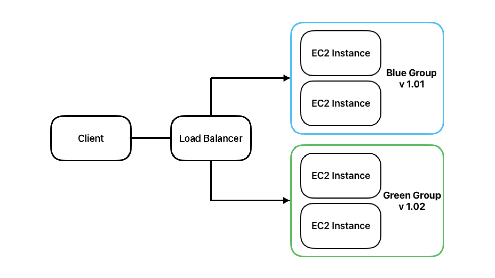

### Blue-Green 배포란?

무중단 배포 기법 중 하나로, Blue는 구버전 Green은 신버전을 의미한다.  
신버전의 인스턴스를 구버전과 동일하게 구성하고, 로드밸런서를 통해 모든 트래픽을 한 번에 신버전으로 전환하는 방식이다.

### 작동 과정

1. Blue 그룹에서 v.1.01 서비스가 동작하다가, Green 그룹에 Blue와 동일한 개수의 인스턴스를 생성한다.
2. Green 그룹에 v.1.02 서비스를 배포한다.
3. Blue, Green 모두에 로드밸런서를 연결하고, 잠시동안 두 개의 그룹이 모두 트래픽을 처리하도록 한다. (이미지 참고)
4. Blue 그룹에 존재하는 모든 인스턴스 종료 후 Blue를 제외한 Green이 모든 요청 처리하도록 로드밸런서를 설정한다.

### 장점과 단점

#### 장점

- 구, 신 버전이 동시에 가동되는 시간을 매우 짧게 처리할 수 있다.
- 문제 발생 시 빠른 롤백이 가능하다.
- 배포 과정에서 인스턴스 수가 줄지 않기 때문에 요청량 처리에 부담이 없다.
- 구 버전 환경을 다음 배포에 재사용할 수 있다.

#### 단점

- 시스템 자원이 두 배로 필요하다.
