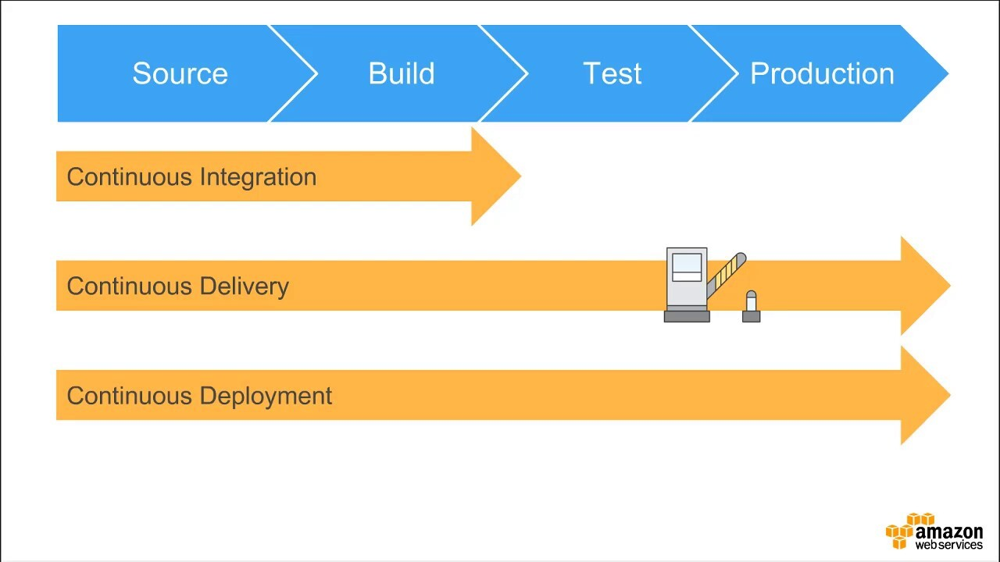

## CI/CD란?

### 1. CI

- Continuous Integration (지속적인 통합)
- 다른 개발자의 코드와 내가 작성한 코드를 통합하여 빌드, 테스트, 머지 과정을 반복하는 것

### 2. CD

- Continuous Delivery/Deployment (지속적인 제공/배포)
- Continuous Delivery, Continuous Deployment를 복합적으로 의미한다.

1. Continuous Delivery: Github와 같은 공유 저장소에 업로드한다.
2. Continuous Deployment: 성공적으로 병합된 내역을 저장소 뿐만 아니라 사용자가 사용할 수 있는 배포환경까지 릴리즈한다.

## CI/CD 적용한 개발 과정

- CI는 개발 단계에서 빈번히 주기적으로 발생한다.
- 배포 단계에서 release를 앞두고 개발자들이 검증한 후 괜찮다고 판단되면 CD를 통해 배포한다.

### CI/CD 툴

- 개발, 배포, 테스트를 자동화할 수 있도록 지원한다.
- Jenkins, CircleCI, TravisCI, Github Actions 등

 

