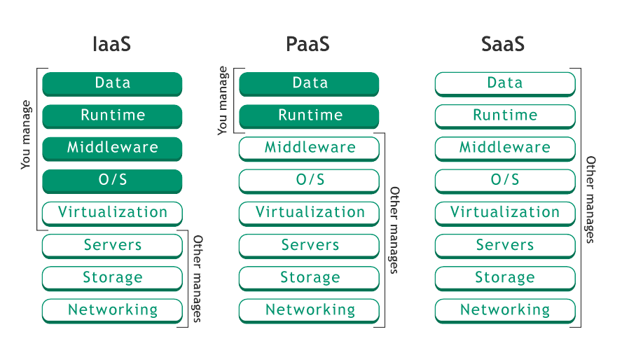

# IaaS, PaaS, SaaS 란?

클라우드 컴퓨팅의 3가지 IaaS, PaaS, SaaS란 무엇일까요? 
3개를 유심히 보면 공통점 하나가 보입니다.
바로 'aaS'인데요.
이는 'as a service'의 약자로 (무엇을) 서비스로 제공한다는 의미입니다. 
과연 IaaS, PaaS, SaaS는 어떤 것들을 서비스로 제공할까요?

## IaaS (Infrastructure as a service)
IaaS는 <strong>'Infrastructure as a service'로 인프라를 서비스로 제공한다</strong>는 뜻입니다.  
인프라는 서버, 스토리지, 네트워크 같은 자원을 말합니다. 이러한 자원을 서비스로 제공하는 것을 IaaS라고 합니다.

## PaaS (Platform as a service)
PaaS는 <strong>'Platform as a service'로 플랫폼을 서비스로 제공한다</strong>는 뜻입니다.  
플랫폼은 여러 사람들이 이용하기 편리하게 해준다는 의미를 가지고 있습니다. 개발자가 코드에 집중할 수 있도록 개발 환경 자체를 플랫폼으로 묶어서 서비스로 제공하는 것을 PaaS라고 합니다.  

IaaS와 PaaS를 정확하게 구분하기 쉽게 예시를 들어보도록하겠습니다.  

최근 '클라우드타입' 이라는 PaaS 배포 프로덕트를 접하게 되었습니다.
클라우드타입을 알기 이전에 개발한 서비스를 배포하기 위해서는 AWS에서 개발 환경에 맞는 인프라(RDS, EC2 등)를 세팅해야했습니다.
AWS에서 인프라를 세팅하는 것은 다른말로 AWS에서 RDS와 EC2같은 것을 IaaS로 제공한다는 의미이기도 합니다.

그러나 클라우드타입은 복잡한 인프라 설정 없이 내가 개발한 환경만 선택하면 알아서 컨테이너 기반으로 배포 환경이 세팅됩니다.

## SaaS (Software as a service)
마지막으로 SaaS는 <strong>'Software as a service'로 소프트웨어를 서비스로 제공한다</strong>는 의미입니다.  
쉽게 말해 이미 구축되어진 어플리케이션을 다운받지 않고 클라우드 환경에서 이용 가능하게 서비스로 제공한다는 뜻입니다.
MS Office, Notion, Figma, Drop Box와 같은 서비스가 이에 해당합니다.